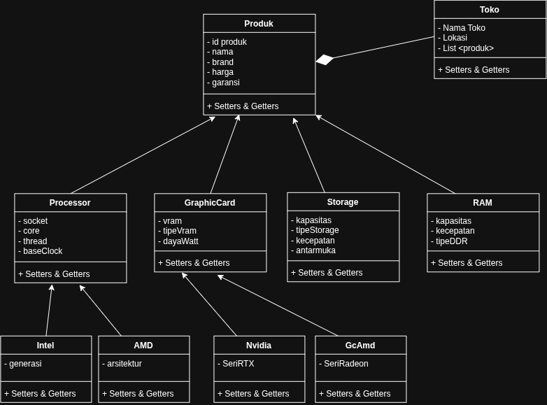

# Tugas Praktikum 3 DPBO — Hierarchical Inheritance & Komposisi

## Janji

Saya Afit Fajar Rianto dengan NIM 2501826 mengerjakan Tugas Praktikum 3 pada Mata Kuliah Desain dan Pemrograman Berorientasi Objek (DPBO) untuk keberkahan-Nya maka saya tidak melakukan kecurangan seperti yang telah dispesifikasikan. Aamiin.

---

# Deskripsi Program

Program ini merupakan implementasi konsep **Object-Oriented Programming (OOP)** dengan menerapkan **Hierarchical Inheritance** (pewarisan bercabang bertingkat) serta **Composition** menggunakan **Array of Objects**.

Studi kasus yang digunakan adalah **Sistem Katalog Toko Komputer/PC**, yang mengelola berbagai macam komponen perangkat keras dengan total 10 buah class.

# Diagram

    

