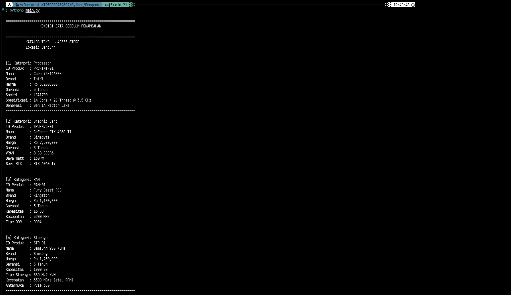
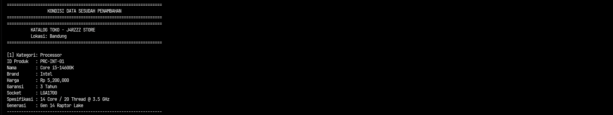

# Tugas Praktikum 3 DPBO — Hierarchical Inheritance & Komposisi

## Janji

Saya Afit Fajar Rianto dengan NIM 2501826 mengerjakan Tugas Praktikum 3 pada Mata Kuliah Desain dan Pemrograman Berorientasi Objek (DPBO) untuk keberkahan-Nya maka saya tidak melakukan kecurangan seperti yang telah dispesifikasikan. Aamiin.

---

# Deskripsi Program

Program ini merupakan implementasi konsep **Object-Oriented Programming (OOP)** dengan menerapkan **Hierarchical Inheritance** (pewarisan bercabang bertingkat) serta **Composition** menggunakan **Array of Objects**.

Studi kasus yang digunakan adalah **Sistem Katalog Toko Komputer/PC**, yang mengelola berbagai macam komponen perangkat keras dengan total 10 buah class.

---

# Struktur File

```text
TP3DPBO2526C2/
├── CPP/
│   ├── Dokumentasi/
│   │   └── cpp.png
│   └── Program/
│       ├── Produk.cpp
│       ├── Processor.cpp
│       ├── Intel.cpp
│       ├── Amd.cpp
│       ├── GraphicCard.cpp
│       ├── Nvidia.cpp
│       ├── GcAmd.cpp
│       ├── Storage.cpp
│       ├── Ram.cpp
│       ├── Toko.cpp
│       └── main.cpp
│
├── Python/
│   ├── Dokumentasi/
│   │   └── python.png
│   └── Program/
│       ├── Produk.py
│       ├── Processor.py
│       ├── Intel.py
│       ├── AMD.py
│       ├── GraphicCard.py
│       ├── Nvidia.py
│       ├── GcAmd.py
│       ├── Storage.py
│       ├── RAM.py
│       ├── Toko.py
│       └── main.py
│
├── diagram/
│   └── class_diagram.png
├── .gitignore
└── README.md
```
---

# Desain / Class Diagram

Class diagram yang digunakan dalam program adalah sebagai berikut:

<div align="center">
    
</div>

Selain hierarki produk di atas, terdapat class `Toko` yang menerapkan konsep **Komposisi (Composition)**, di mana satu objek Toko menampung kumpulan banyak objek produk `(List of Objects / vector<Produk*>)`.

Program ini dibuat untuk mensimulasikan pencatatan stok barang di katalog toko:
- Menampilkan kondisi katalog sebelum penambahan (data statis awal).
- Menampilkan kondisi katalog sesudah penambahan objek baru secara dinamis.

Seluruh atribut dibungkus secara aman (encapsulation) menggunakan Setter dan Getter. Logika tampilan dipusatkan pada fungsi/prosedur di file `main` untuk menjaga kemurnian representasi data class.

- `Produk` → Parent / Base Superclass
Class dasar yang memuat informasi identitas umum dari seluruh barang yang dijual di toko hardware.
- `Processor`, `GraphicCard`, `Storage`, `RAM` → Child Class Level 1
Empat cabang utama yang mewarisi class `Produk` serta menambahkan karakteristik spesifik dari tiap kategori perangkat keras.
- `Intel`, `AMD`, `Nvidia`, `GcAmd` → Child Class Level 2
Kelas turunan yang lebih mendalam untuk merepresentasikan lini dan arsitektur spesifik pabrikan (vendor-specific).
- `Toko` → Container Class (Komposisi)
Class yang berperan sebagai wadah utama dan memiliki relasi komposisi (has-a) dengan menampung array of objects dari pointer/objek `Produk`.

Program diimplementasikan dalam 3 bahasa pemrograman:
- Python
- C++
- Java

---

# Penjelasan Atribut dan Method

### 1. Class `Produk` (Superclass)
Class dasar yang mendefinisikan informasi umum setiap perangkat keras komputer[cite: 1].

| Komponen | Nama | Tipe Data / Return | Keterangan |
|---|---|---|---|
| **Atribut** | `id_produk` | String | Kode pengenal unik produk[cite: 1, 5]. |
| | `nama` | String | Nama model produk[cite: 1]. |
| | `brand` | String | Merk produsen pembuat[cite: 1]. |
| | `harga` | Double | Harga jual komponen (Rupiah)[cite: 1]. |
| | `garansi` | Integer | Masa garansi resmi dalam satuan tahun[cite: 1]. |
| **Method** | `set_id_produk(string)` | void | Mengubah atau menetapkan ID produk. |
| | `get_id_produk()` | String | Mengambil nilai ID produk. |
| | `set_nama(string)` | void | Mengubah atau menetapkan nama produk. |
| | `get_nama()` | String | Mengambil nilai nama produk. |
| | `set_brand(string)` | void | Mengubah atau menetapkan brand produk. |
| | `get_brand()` | String | Mengambil nilai brand produk. |
| | `set_harga(double)` | void | Mengubah atau menetapkan harga produk. |
| | `get_harga()` | Double | Mengambil nilai harga produk. |
| | `set_garansi(int)` | void | Mengubah atau menetapkan masa garansi. |
| | `get_garansi()` | Integer | Mengambil nilai masa garansi. |

---

### 2. Class `Processor` (Turunan `Produk`)
Mewarisi seluruh atribut `Produk` dan menambahkan spesifikasi teknis CPU[cite: 1].

| Komponen | Nama | Tipe Data / Return | Keterangan |
|---|---|---|---|
| **Atribut** | `socket` | String | Jenis socket dudukan motherboard (misal: LGA1700, AM5)[cite: 1]. |
| | `core` | Integer | Jumlah core pemrosesan fisik[cite: 1]. |
| | `thread` | Integer | Jumlah thread pemrosesan[cite: 1]. |
| | `base_clock` | Double | Frekuensi kerja dasar dalam satuan GHz[cite: 1]. |
| **Method** | `set_socket(string)` | void | Menetapkan tipe socket CPU. |
| | `get_socket()` | String | Mengambil tipe socket CPU. |
| | `set_core(int)` | void | Menetapkan jumlah core. |
| | `get_core()` | Integer | Mengambil jumlah core. |
| | `set_thread(int)` | void | Menetapkan jumlah thread. |
| | `get_thread()` | Integer | Mengambil jumlah thread. |
| | `set_base_clock(double)` | void | Menetapkan kecepatan base clock. |
| | `get_base_clock()` | Double | Mengambil kecepatan base clock. |

---

### 3. Class `Intel` & `AMD` (Turunan `Processor`)
Spesifikasi arsitektur lini prosesor[cite: 1].

| Class | Komponen | Nama | Tipe Data / Return | Keterangan |
|---|---|---|---|---|
| **Intel** | Atribut | `generasi` | String | Penomoran generasi mikroarsitektur Intel[cite: 1]. |
| | Method | `set_generasi(string)` | void | Menetapkan generasi prosesor Intel. |
| | | `get_generasi()` | String | Mengambil data generasi prosesor Intel. |
| **AMD** | Atribut | `arsitektur` | String | Arsitektur core AMD (contoh: Zen 4)[cite: 1]. |
| | Method | `set_arsitektur(string)` | void | Menetapkan nama arsitektur prosesor AMD. |
| | | `get_arsitektur()` | String | Mengambil nama arsitektur prosesor AMD. |

---

### 4. Class `GraphicCard` (Turunan `Produk`)
Mewarisi `Produk` dan memuat spesifikasi GPU[cite: 1].

| Komponen | Nama | Tipe Data / Return | Keterangan |
|---|---|---|---|
| **Atribut** | `vram` | Integer | Kapasitas memori video dalam satuan GB[cite: 1]. |
| | `tipe_vram` | String | Standar tipe VRAM (contoh: GDDR6, GDDR6X)[cite: 1]. |
| | `daya_watt` | Integer | Kebutuhan konsumsi daya listrik (Watt)[cite: 1]. |
| **Method** | `set_vram(int)` | void | Menetapkan besaran VRAM. |
| | `get_vram()` | Integer | Mengambil besaran VRAM. |
| | `set_tipe_vram(string)` | void | Menetapkan tipe VRAM. |
| | `get_tipe_vram()` | String | Mengambil tipe VRAM. |
| | `set_daya_watt(int)` | void | Menetapkan kebutuhan daya listrik. |
| | `get_daya_watt()` | Integer | Mengambil kebutuhan daya listrik. |

---

### 5. Class `Nvidia` & `GcAmd` (Turunan `GraphicCard`)
Spesifikasi seri khusus kartu grafis[cite: 1].

| Class | Komponen | Nama | Tipe Data / Return | Keterangan |
|---|---|---|---|---|
| **Nvidia** | Atribut | `seri_rtx` | String | Seri kartu grafis GeForce RTX[cite: 1]. |
| | Method | `set_seri_rtx(string)` | void | Menetapkan penamaan seri RTX. |
| | | `get_seri_rtx()` | String | Mengambil penamaan seri RTX. |
| **GcAmd** | Atribut | `seri_radeon` | String | Seri kartu grafis Radeon RX[cite: 1]. |
| | Method | `set_seri_radeon(string)` | void | Menetapkan penamaan seri Radeon. |
| | | `get_seri_radeon()` | String | Mengambil penamaan seri Radeon. |

---

### 6. Class `Storage` (Turunan `Produk`)
Media penyimpanan data[cite: 1].

| Komponen | Nama | Tipe Data / Return | Keterangan |
|---|---|---|---|
| **Atribut** | `kapasitas` | Integer | Kapasitas media simpan (GB)[cite: 1]. |
| | `tipe_storage` | String | Jenis media (SSD NVMe, HDD, SSD SATA)[cite: 1]. |
| | `kecepatan` | Integer | Kecepatan baca/tulis (MB/s atau RPM)[cite: 1]. |
| | `antarmuka` | String | Interface jalur data (PCIe Gen 4, SATA III)[cite: 1]. |
| **Method** | `set_kapasitas(int)` | void | Menetapkan kapasitas storage. |
| | `get_kapasitas()` | Integer | Mengambil kapasitas storage. |
| | `set_tipe_storage(string)` | void | Menetapkan tipe storage. |
| | `get_tipe_storage()` | String | Mengambil tipe storage. |
| | `set_kecepatan(int)` | void | Menetapkan kecepatan baca/tulis. |
| | `get_kecepatan()` | Integer | Mengambil kecepatan baca/tulis. |
| | `set_antarmuka(string)` | void | Menetapkan antarmuka koneksi data. |
| | `get_antarmuka()` | String | Mengambil antarmuka koneksi data. |

---

### 7. Class `RAM` (Turunan `Produk`)
Memori utama sistem[cite: 1].

| Komponen | Nama | Tipe Data / Return | Keterangan |
|---|---|---|---|
| **Atribut** | `kapasitas` | Integer | Besaran memori dalam satuan GB[cite: 1]. |
| | `kecepatan` | Integer | Frekuensi clock kecepatan memori (MHz)[cite: 1]. |
| | `tipe_ddr` | String | Generasi standar RAM (DDR4 / DDR5)[cite: 1]. |
| **Method** | `set_kapasitas(int)` | void | Menetapkan kapasitas RAM. |
| | `get_kapasitas()` | Integer | Mengambil kapasitas RAM. |
| | `set_kecepatan(int)` | void | Menetapkan frekuensi RAM. |
| | `get_kecepatan()` | Integer | Mengambil frekuensi RAM. |
| | `set_tipe_ddr(string)` | void | Menetapkan generasi DDR RAM. |
| | `get_tipe_ddr()` | String | Mengambil generasi DDR RAM. |

---

### 8. Class `Toko` (Komposisi / Container)
Class penampung kumpulan objek `Produk`[cite: 1].

| Komponen | Nama | Tipe Data / Return | Keterangan |
|---|---|---|---|
| **Atribut** | `nama_toko` | String | Nama toko PC[cite: 1]. |
| | `lokasi` | String | Alamat/kota operasional toko[cite: 1]. |
| | `list_produk` | Array / Vector | Wadah penyimpanan array of objects `Produk`[cite: 1]. |
| **Method** | `set_nama_toko(string)` | void | Menetapkan nama toko[cite: 1]. |
| | `get_nama_toko()` | String | Mengambil nama toko[cite: 1]. |
| | `set_lokasi(string)` | void | Menetapkan lokasi toko[cite: 1]. |
| | `get_lokasi()` | String | Mengambil lokasi toko[cite: 1]. |
| | `set_list_produk(list/vector)` | void | Menetapkan seluruh daftar produk[cite: 1]. |
| | `get_list_produk()` | Array / Vector | Mengambil seluruh koleksi objek produk[cite: 1]. |
| | `tambah_produk(Produk*)` | void | Memasukkan satu objek produk baru ke dalam array[cite: 1]. |

---
# Dokumentasi Prorgram

### Python
<div align="center">
    
</div>
<div align="center">
    
</div>
<div align="center">
    
</div>

Dokumentasi di atas menunjukkan hasil implementasi program menggunakan bahasa Python.